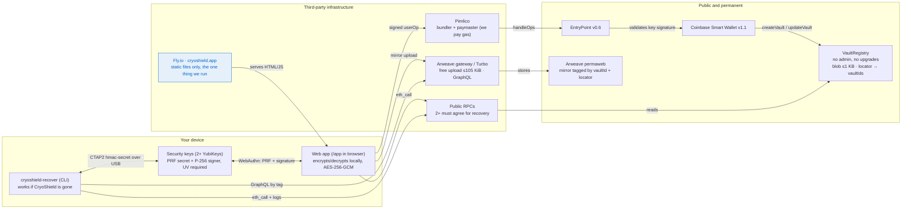
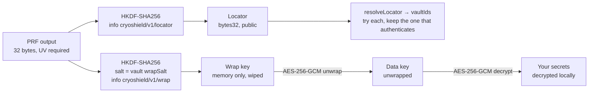
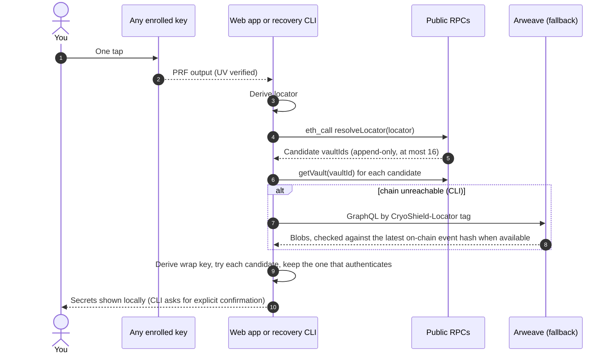
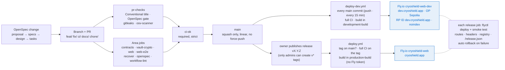

# CryoShield system design

How a secret travels from your browser to permanent storage and back, which parts CryoShield runs, and how code reaches production.

> **Status:** OP Sepolia testnet, not independently audited. Mainnet will be OP Mainnet.
> Last updated 2026-10-03. Normative details live in `openspec/specs/` and `docs/spec/vault-format-v1.md`; this page is the map.

## 1. Components and trust boundaries

CryoShield operates exactly one thing: a static website on Fly. Everything else runs on your device, or is third-party or public infrastructure that never sees a plaintext secret.



- **Writes** go through Pimlico because CryoShield sponsors gas. The client allowlist only lets a sponsored operation call the VaultRegistry (or the account itself, to add an owner) with `value == 0`.
- **Reads, unlocks and recovery** never touch Pimlico or Fly. The recovery tool talks to the key over USB and reads the chain or Arweave directly, so it keeps working if the website, the domain or the company disappears.
- **The domain** `cryoshield.app` is the permanent WebAuthn RP ID. Losing control of it would let an attacker prompt users' keys in a browser. It is protected by DNSSEC, a CAA record (Let's Encrypt only), HSTS preload and registrar lock. The desktop tool is unaffected, because it is not bound by browser origin checks.

## 2. From one key tap to your secret

Each tap returns one 32-byte PRF output for a fixed global salt. Two independent keys are derived from it: one is public (the lookup), and one never leaves memory (the wrap key).



- **Symmetric only.** The ciphertext stays public forever, so it has no elliptic-curve layer that a future quantum computer could strip.
- **One wrap per key.** Every enrolled key wraps its own copy of the data key. Losing one key loses nothing. Losing every key loses the vault, and nobody can reset it.
- **Clone-proof.** The AAD binds the vault header and the 32-byte `vaultId`. A blob copied under any other vaultId fails to authenticate and is skipped.
- **UV is mandatory, and the key enforces it via credProtect level 3.** hmac-secret returns different outputs with and without user verification. Without UV, browser and desktop could derive different keys.
  - Every key is enrolled with credProtect level 3 (`userVerificationRequired`, requested with enforcement and confirmed from the authenticator data). A stolen key will not produce *any* assertion without its PIN, even though credential IDs are public and the smart wallet does not itself require UV or check rpId and origin (audit AA-H1).
  - Keys enrolled before this rule must be re-created; that is only the founder's test vault.
  - A contract-level validator that checks UV, rpId and origin is planned, and it is a hard gate for mainnet. It also closes the U2F/CTAP1 path, where a key that accepts a CTAP2 credential ID over U2F could sign without its PIN.
- **Desktop salt mapping.** CTAP salt = `SHA-256("WebAuthn PRF" || 0x00 || input)`. This lets the browser and the desktop tool derive identical outputs.

## 3. Create a vault

```mermaid
sequenceDiagram
  autonumber
  actor U as You
  participant K as Security keys
  participant W as Web app
  participant P as Pimlico
  participant C as OP Sepolia (EntryPoint → Smart Wallet → VaultRegistry)
  participant A as Arweave

  U->>K: Tap key 1, then key 2
  K-->>W: Discoverable credential + PRF output + P-256 public key (each)
  W->>W: assertUserVerified; random vaultId; encrypt secret; wrap data key per key
  U->>K: One more tap
  K-->>W: Signature over the userOp
  W->>P: eth_chainId guard, then sponsored userOp
  P->>C: handleOps → createVault(vaultId, blob, locators)
  W->>A: Upload blob, tags CryoShield-Vault-Id + CryoShield-Locator
  W->>W: Zeroize PRF outputs and keys
```

- `LocatorFull`: a front-runner filled the locator. The app enrolls a fresh credential, which gives a new locator.
- `VaultIdTaken`: the app re-encrypts under a fresh vaultId and asks for one more tap of key 1.

## 4. Unlock or recover



- No account, no gas and no wallet are needed to read.
- **Web app guard:** the web app checks the RPC's `eth_chainId` before any registry read, and refuses with "wrong network" rather than a misleading "no vault".
- **Recovery CLI hardening:**
  - hostile JSON from a server is discarded and recovery continues;
  - disagreeing RPCs are compared to the latest event hash;
  - event history needs 2 agreeing configured RPCs;
  - remote text is stripped of terminal escape sequences.

## 5. How code reaches cryoshield.app

Nothing reaches `main` or production without a spec, a pull request and a green `ci-ok`. The `main` ruleset has no bypass actors, so this applies to admins too. Every new commit on `main` is then deployed to the **development** site https://dev.cryoshield.app by `.github/workflows/deploy-dev.yml`, after the full CI passes again on that exact commit. **Production** is deployed by `.github/workflows/deploy.yml` only when the owner publishes a `v*` release of a commit on `main` (runbook: `docs/deploy.md`; change `split-dev-and-release-deploys`). Agents work through a non-admin machine account (`docs/agent-account.md`) that cannot create `v*` tags, so an auto-merged PR reaches `main` and dev, but never production by itself.



- **Security review.** Every change touching crypto, contracts, the paymaster or secret handling ends with a security-review task. The records are in `docs/reviews/` and `apps/web/docs/`.
- **Pinned toolchain.** All third-party GitHub Actions are pinned by commit SHA. The gitleaks and osv-scanner binaries are pinned by version and checksum. Installs fail on lockfile drift.
- **Rebuildable deploys.** Every deploy writes `apps/web/deploy/.build/release-manifest.json` with the commit and a deterministic tree hash, so anyone can rebuild the site and compare it with what Fly serves. The site also serves the commit, tree hash and public config at `https://cryoshield.app/release.json` (not part of the tree hash), so anyone can see which commit is live.
- **Continuous deployment to dev, owner releases to production.**
  - `deploy-dev.yml` runs on every push to `main`, every 15 minutes (merges made by auto-merge start no push workflow), and on demand. It skips when the dev site's `/release.json` already shows the `main` HEAD.
  - `deploy.yml` runs only for a release the owner publishes (or the owner's redeploy of a tag). It refuses a tag that is not on `main`.
  - Both run the full `ci.yml` on the exact commit, and build with the guarded `deploy.sh --build-only` in a build environment that has no Fly token.
  - Both then run one `release` job in their own token environment: `development` holds a token for `cryoshield-web-dev` only, and `production` one for `cryoshield-web`. The job runs the flyctl-only deploy, the smoke test, and the automatic rollback to the previous image on any failure or cancellation.
  - The two pipelines use separate concurrency groups and never cancel each other.
  - The dev site uses its own WebAuthn RP ID (`dev.cryoshield.app`), so its vaults are unrelated to production's; see threat T1 in the change's design for why it should move to a separate registrable domain before mainnet.

## 6. Hosting and headers

The static site is served by a digest-pinned Caddy image that runs as a non-root user.

| Header | Value |
|---|---|
| Content-Security-Policy | Derived from the built meta CSP, plus `frame-ancestors 'none'`. No `unsafe-eval` or `unsafe-inline`; Trusted Types `'none'` |
| Strict-Transport-Security | `max-age=63072000; includeSubDomains; preload` |
| X-Frame-Options | `DENY` |
| Permissions-Policy | `publickey-credentials-get/create=(self)`; camera, microphone, geolocation, USB and the rest denied |
| Referrer-Policy | `no-referrer` |
| Cross-Origin-Opener-Policy | `same-origin` |
| X-Content-Type-Options | `nosniff` |

- **Redirects:** every non-apex host, including `*.fly.dev`, is sent with a 301 to `https://cryoshield.app`, except `/healthz`.
- **Caching:** `index.html` is `no-cache`, and hashed assets are `immutable`.
- **Routes:** the landing page is at `/` and loads Motion lazily; it never loads React, viem or vault code. The vault app is at `/app/`.

## 7. Live reference values

| Item | Value |
|---|---|
| Network | OP Sepolia, chain 11155420 (mainnet: OP Mainnet, not deployed yet) |
| VaultRegistry | `0xB43f58cF17e64B603aE5588a1DD17E96a0849e44` (same CREATE2 address on every chain) |
| Deploy block | `49568053` |
| Smart account | Coinbase Smart Wallet v1.1 on EntryPoint v0.6; P-256 precompile at `0x100` |
| WebAuthn RP ID | `cryoshield.app` (permanent) |
| Hosting | Fly app `cryoshield-web`, org `cryoshield`, region `sin`; DNSSEC and CAA on |
| Vault limits | blob ≤ 1024 bytes · 2–8 keys · 16 vaults per locator |
| Chain presets | `config/chain-presets.json` (anvil, op-sepolia, op-mainnet, arbitrum-sepolia, arbitrum-one) |
| License | MIT |

## 8. Where to look next

| Topic | File |
|---|---|
| Vault binary format and derivations | `docs/spec/vault-format-v1.md`, `openspec/specs/vault-crypto/` |
| Contract | `contracts/src/VaultRegistry.sol`, `contracts/README.md`, `contracts/GAS.md` |
| Web app, paymaster policy, costs | `apps/web/docs/` |
| Hosting runbook and DNS hardening | `apps/web/deploy/README.md` |
| Recovery tool and manual YubiKey test | `tools/recover/README.md`, `tools/recover/docs/manual-yubikey-test.md` |
| Design language | `docs/design/visual-language.md` |
| Product requirements | `.claude/PRPs/prds/cryoshield.prd.md` |
